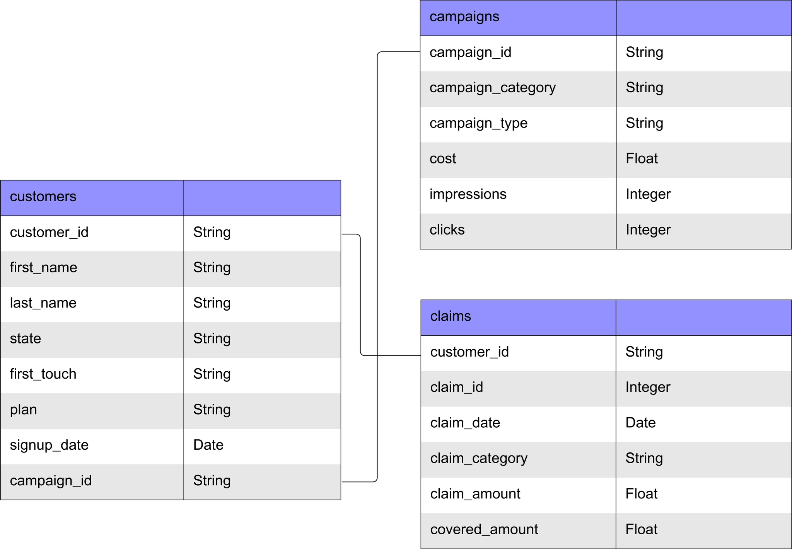
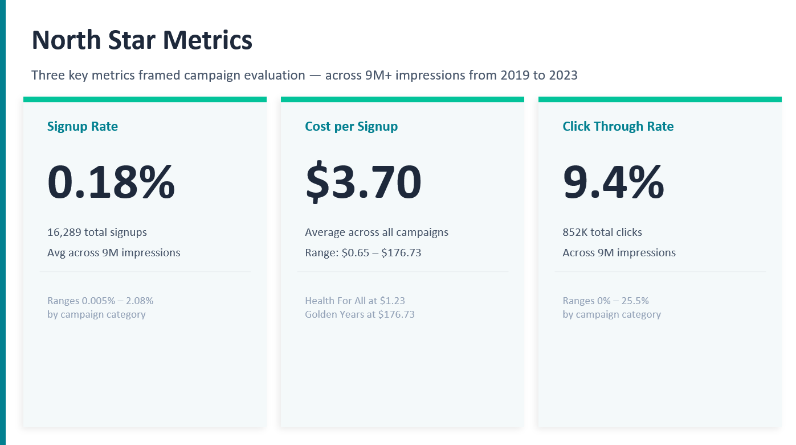
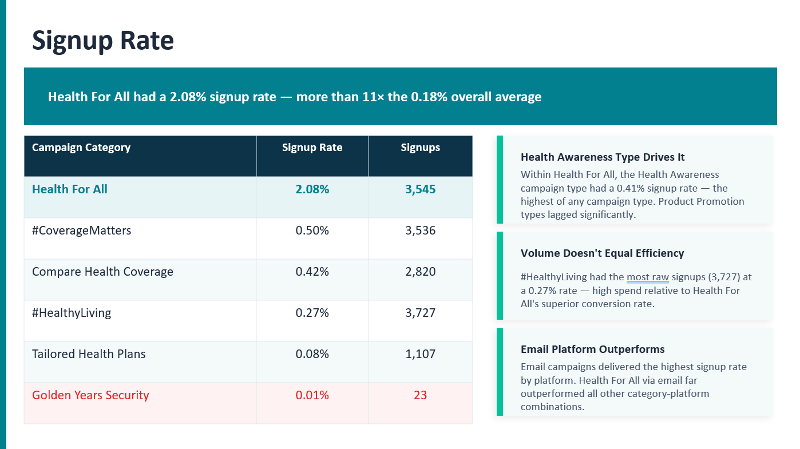
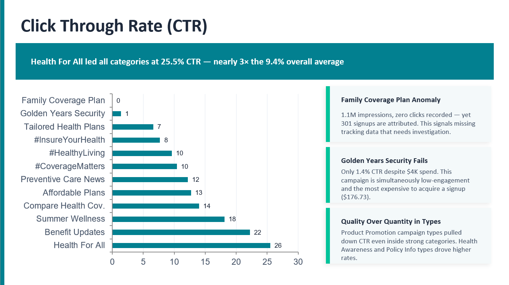
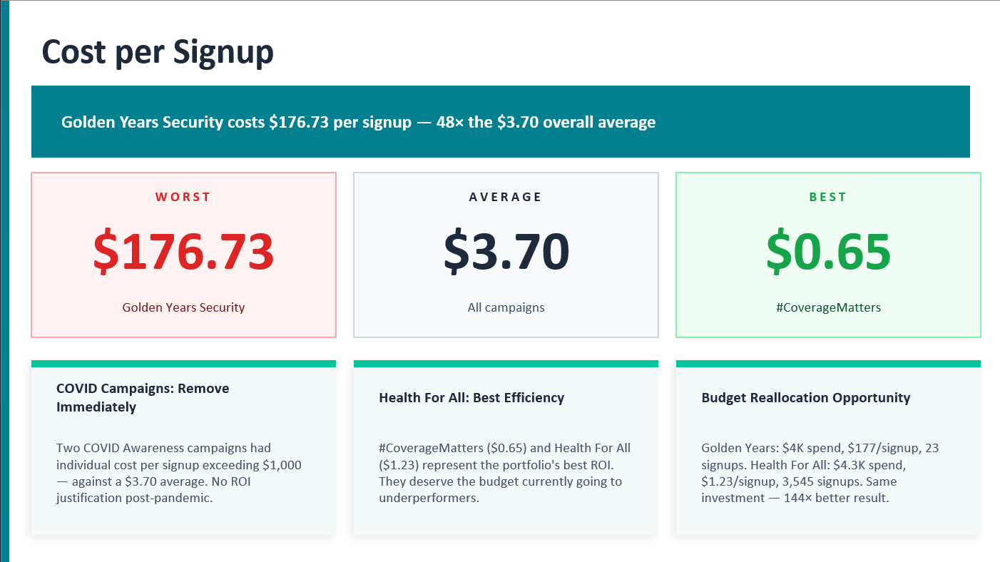
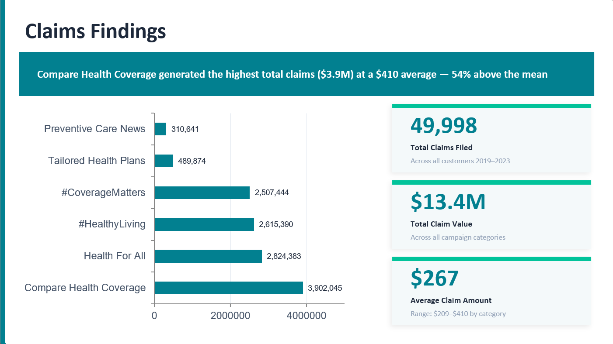
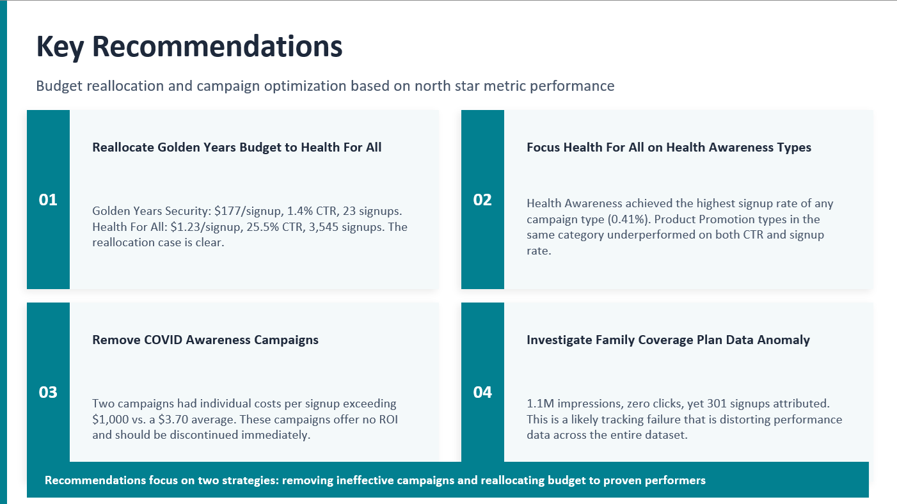
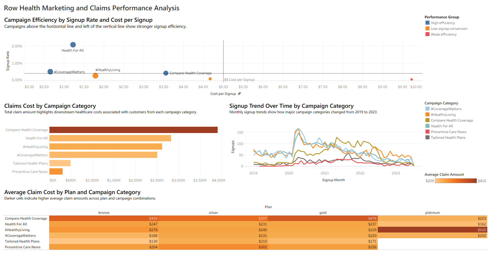
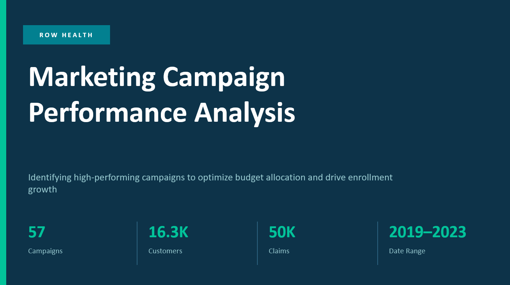
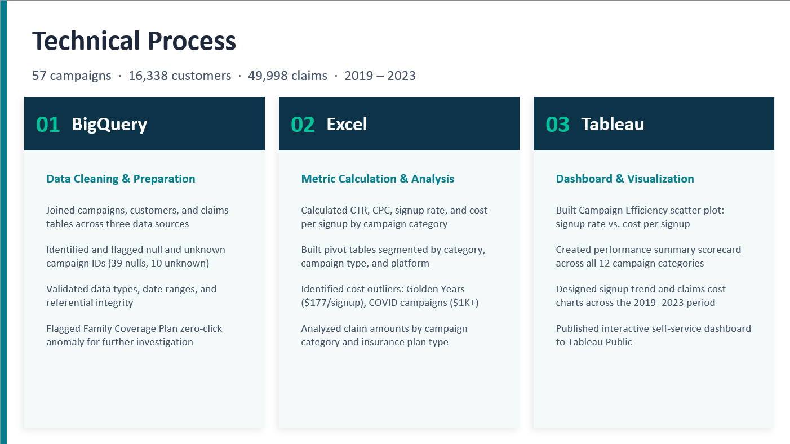

# Row Health — Marketing Campaign Performance Analysis

**Founded in 2016, Row Health is a U.S. medical insurance company** offering Bronze, Silver, Gold, and Platinum coverage plans to customers across the country. In 2019, they launched a broad set of marketing campaigns spanning health awareness, wellness tips, plan affordability, and preventative care — running across email, social media, SEO, and TV platforms.

With a new data team in place and annual budget planning underway, Row Health's leadership needed to understand which campaigns were actually working — and where money was being wasted. This project delivers that analysis.

**The goal:** Evaluate marketing campaign performance from 2019 to 2023 and surface actionable recommendations for budget reallocation.

---

## Table of Contents

- [Dataset Structure](#dataset-structure)
- [North Star Metrics](#north-star-metrics)
- [Key Insights](#key-insights)
- [Recommendations](#recommendations)
- [Dashboard](#dashboard)
- [Presentation](#presentation)
- [Technical Process](#technical-process)

---

## Dataset Structure

The analysis used three tables joined in BigQuery, covering 57 unique campaigns and 16,338 customers across five years.

| Table | Key Fields |
|---|---|
| `campaigns` | campaign_id, campaign_category, campaign_type, cost, impressions, clicks |
| `customers` | customer_id, plan, state, first_touch, signup_date, campaign_id |
| `claims` | customer_id, claim_id, claim_date, claim_category, claim_amount, covered_amount |

---

## North Star Metrics

To evaluate campaign effectiveness, the analysis focused on three metrics aligned with Row Health's two primary objectives — increasing signups and raising brand awareness.

| Metric | Overall Value | What It Measures |
|---|---|---|
| **Signup Rate** | 0.18% | % of impressions that converted to a signup |
| **Cost per Signup** | $3.70 | Avg marketing dollars spent per new customer |
| **Click Through Rate** | 9.4% | % of impressions that resulted in a click |

> Signup rate ranged from 0.005% to 2.08% across campaign categories. Cost per signup ranged from $0.65 to $176.73. These extremes are where the most actionable insights live.

---

## Key Insights

### Signup Rate

**Health For All campaigns had a 2.08% signup rate — more than 11× the 0.18% overall average.**

- Health For All was the clear leader in conversion efficiency, driven specifically by the **Health Awareness campaign type**, which achieved a 0.41% signup rate — the highest of any campaign type in the dataset.
- **#HealthyLiving** had the most raw signups (3,727) but only a 0.27% signup rate, indicating high impression volume without proportional conversion.
- Email was the strongest platform for the signup rate. Health For All via email far outperformed all other category-platform combinations.

| Campaign Category | Signup Rate | Signups |
|---|---|---|
| Health For All | 2.08% | 3,545 |
| #CoverageMatters | 0.50% | 3,536 |
| Compare Health Coverage | 0.42% | 2,820 |
| #HealthyLiving | 0.27% | 3,727 |
| Tailored Health Plans | 0.08% | 1,107 |
| Golden Years Security | 0.01% | 23 |

---

### Click Through Rate

**Health For All led all categories at 25.5% CTR — nearly 3× the 9.4% overall average.**

- Health For All (25.5%) and Benefit Updates (22.2%) were the only categories to outperform the average CTR significantly.
- **Family Coverage Plan is a data anomaly:** 1.1 million impressions were recorded with zero clicks, yet 301 signups are attributed to this campaign — pointing to a tracking failure that distorts performance metrics.
- **Golden Years Security** produced only 1.4% CTR despite $4,065 in spend, making it simultaneously the lowest-engagement and highest cost-per-signup category in the portfolio.

---

### Cost per Signup

**Golden Years Security costs $176.73 per signup — 48× the $3.70 overall average.**

- **#CoverageMatters** was the most cost-efficient category at $0.65 per signup, followed by Health For All at $1.23.
- Two COVID Awareness campaigns had individual cost per signup exceeding $1,000 on combined spend that produced only 2 signups total.
- Golden Years Security ($4,065 spent, 23 signups) vs. Health For All ($4,347 spent, 3,545 signups) is the clearest budget reallocation opportunity in the data.

---

### Claims Findings

**Compare Health Coverage generated the highest total claim value ($3.9M) at a $410 average — 54% above the $267 overall mean.**

- Health For All had the highest claim count (12,232) at a $231 average — below the overall mean, suggesting its customers are lower-cost to serve relative to revenue.
- Claim counts and amounts peaked across all categories in May 2022 and have declined through 2023.
- Total claim volume does not appear to be directly driven by marketing campaign category, suggesting claims correlate more closely with plan type and customer demographics.

---

## Recommendations

**01 — Reallocate Golden Years Security budget to Health For All**
Golden Years Security: $4,065 spent, 23 signups, $176.73 per signup, 1.4% CTR. Health For All: $4,347 spent, 3,545 signups, $1.23 per signup, 25.5% CTR. Same investment — 144× better outcome.

**02 — Prioritize Health Awareness campaign types within Health For All**
Health Awareness was the highest-performing campaign type at a 0.41% signup rate. Product Promotion types within the same category underperformed significantly on both CTR and signup rate.

**03 — Remove COVID Awareness campaigns**
Two COVID-based campaigns produced 2 signups at costs exceeding $1,000 each. These campaigns have no viable path to ROI and should be discontinued.

**04 — Investigate the Family Coverage Plan data anomaly**
1.1 million impressions, zero clicks, 301 attributed signups. This is a fundamental tracking inconsistency that needs to be resolved before any budget decisions are made around this category.

---

## Dashboard

The interactive dashboard was built in Tableau and allows filtering by plan type, state, and campaign category. It includes a Campaign Efficiency scatter plot, a performance summary scorecard, a signup trend line chart, a claims cost breakdown, and an average claim heatmap by plan and campaign category.

**[View the Dashboard on Tableau Public →](https://public.tableau.com/app/profile/owen.campbell3197/viz/RowHealthMarketingandClaimsAnalysis/RowHealthDashboard)**

---

## Presentation

A full presentation of findings and recommendations was prepared for Row Health's marketing leadership team.

---

## Technical Process

**Dataset:** 57 campaigns · 16,338 customers · 49,998 claims · 2019–2023

**BigQuery — Data Cleaning & Preparation**
- Joined the campaigns, customers, and claims tables across three data sources
- Identified and flagged 39 null and 10 unknown campaign IDs
- Validated data types, date ranges, and referential integrity
- Flagged the Family Coverage Plan zero-click anomaly for further investigation

**Excel — Metric Calculation & Analysis**
- Calculated CTR, CPC, signup rate, and cost per signup by campaign category and type
- Built pivot tables segmented by category, campaign type, platform, and plan
- Identified cost outliers: Golden Years Security ($176.73/signup) and COVID campaigns ($1K+)
- Analyzed claim amounts by campaign category and insurance plan type

**Tableau — Dashboard & Visualization**
- Built a Campaign Efficiency scatter plot comparing signup rate vs. cost per signup
- Created a performance summary scorecard across all 12 campaign categories
- Designed signup trend and claims cost charts across the full 2019–2023 period
- Published an interactive self-service dashboard to Tableau Public